# Laptop Request Management – ServiceNow

## Project Overview

Laptop Request Management is a custom ServiceNow scoped application designed to manage employee laptop requests through an automated request and approval lifecycle.

The application demonstrates ServiceNow application development, role-based security, backend validation, workflow automation, manager approvals, email notifications, Service Catalog integration, and Update Set deployment.

## Demo

This project demonstrates an end-to-end laptop request management process in ServiceNow:

1. Employee submits a laptop request.
2. System checks for duplicate requests.
3. Request is submitted for manager approval.
4. Manager approves or rejects the request.
5. Request status is updated automatically.
6. Email notifications are triggered.
7. Role-based access is enforced using ACLs.

## Technologies Used

- ServiceNow
- Scoped Application
- Flow Designer
- Business Rules
- Access Control Lists (ACLs)
- Service Catalog
- Record Producer
- Approval Management
- JavaScript
- Update Sets

## Application

- **Application:** Project Application
- **Type:** Scoped Application
- **Version:** 1.0.0
- **Platform:** ServiceNow

## Key Features

- Employee laptop request form
- Employee and IT Manager roles
- Role-based access control using ACLs
- Manager approval workflow
- Approval relationship with `sysapproval_approver`
- Duplicate request validation
- Business Rule enforcement
- Record Producer
- Employee Service Catalog
- Flow Designer automation
- Approval and rejection handling
- Email notifications
- Update Set based deployment

## Request Workflow

```text
Employee submits Laptop Request
             ↓
     Duplicate Request Check
             ↓
       Request Validation
             ↓
       Manager Approval
          ↙       ↘
     Approved     Rejected
        ↓            ↓
   Update Status  Update Status
        ↓            ↓
   Email Notice   Email Notice
```
## Screenshots

### 1. Project Application
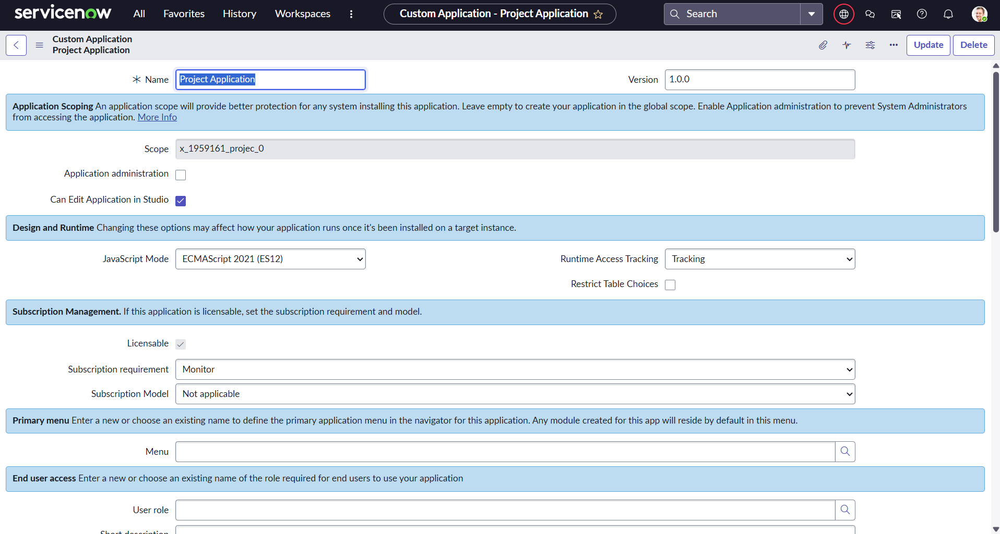

### 2. Laptop Request Form
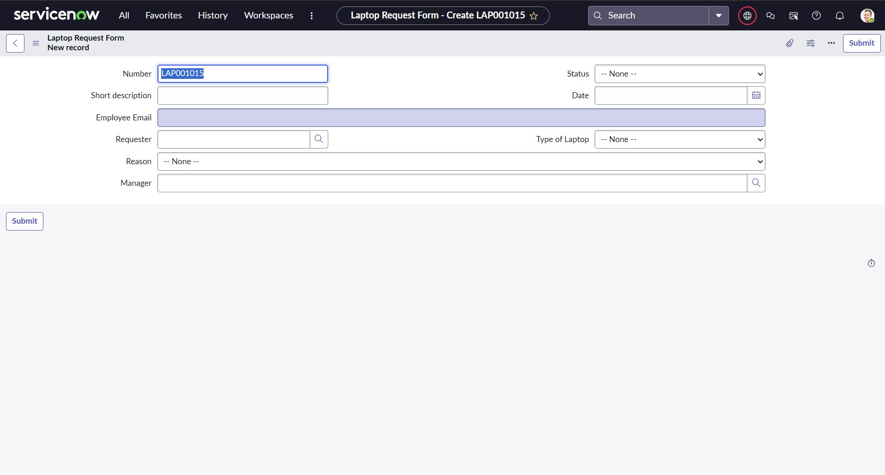

### 3. Employee Request
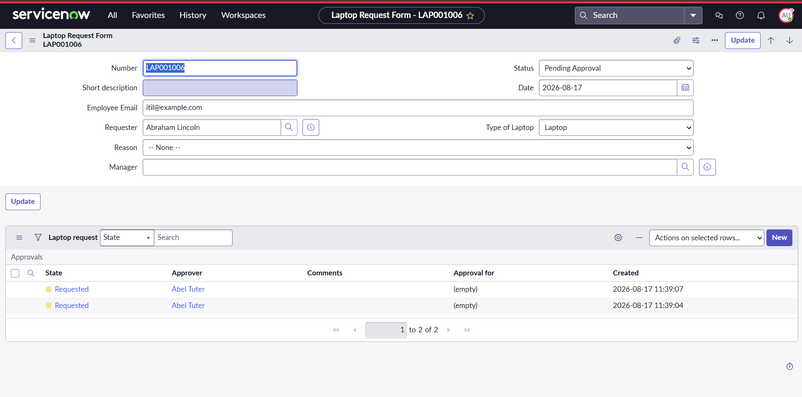

### 4. Employee Role
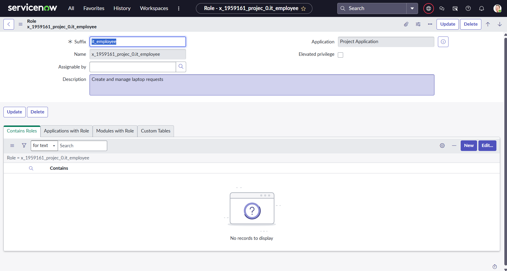

### 5. Manager Role
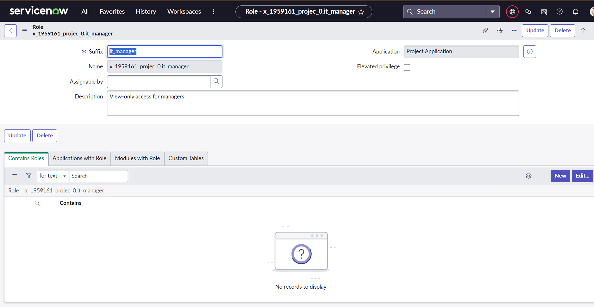

### 6. ACL - Employee Create Access
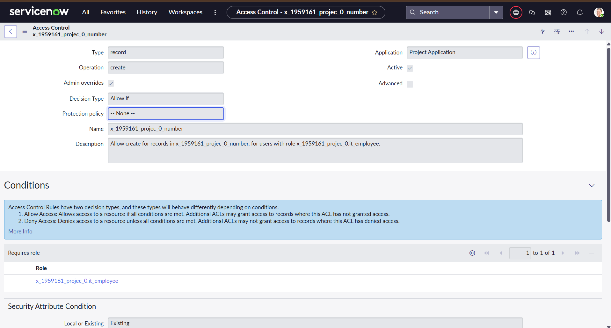

### 7. ACL - Manager Read Access
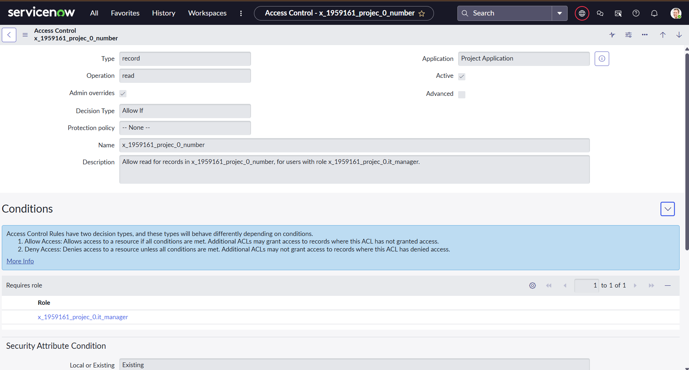

### 8. Approval Relationship
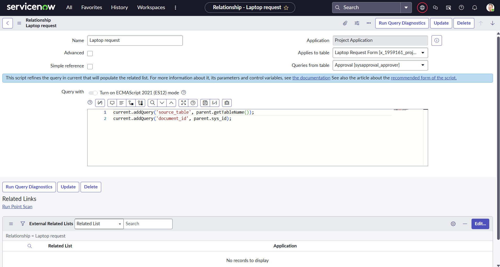

### 9. Business Rule - Duplicate Request
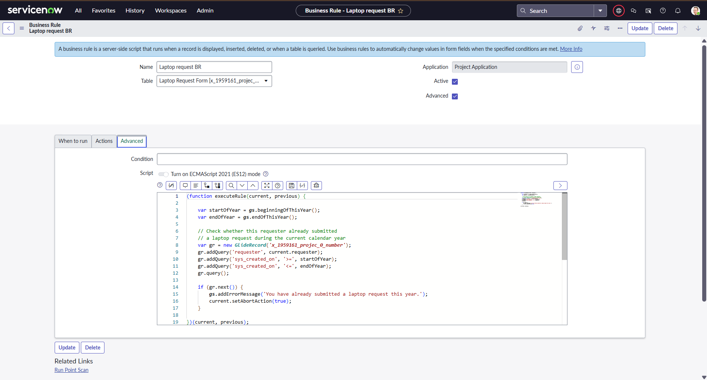

### 10. Duplicate Request Blocked
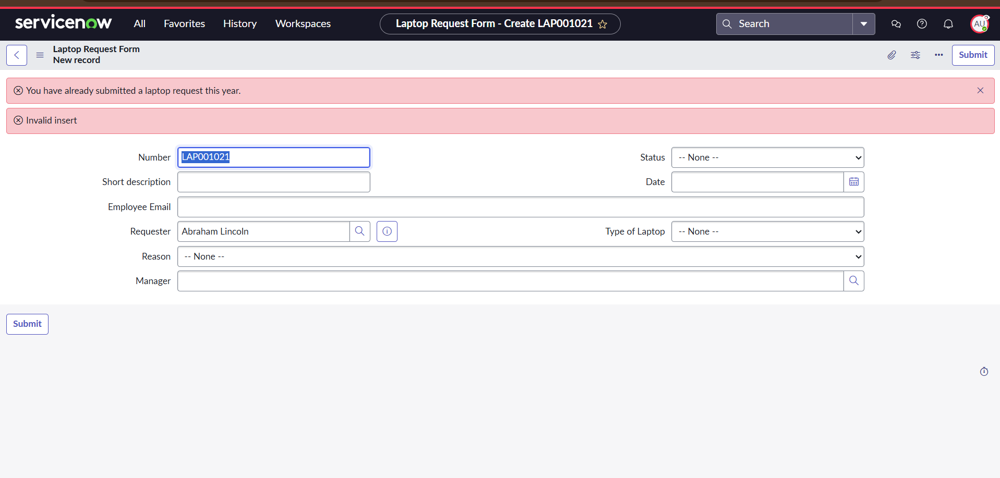

### 11. Record Producer
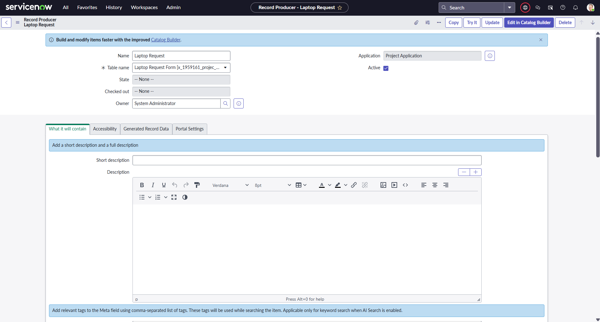

### 12. Employee Service Catalog
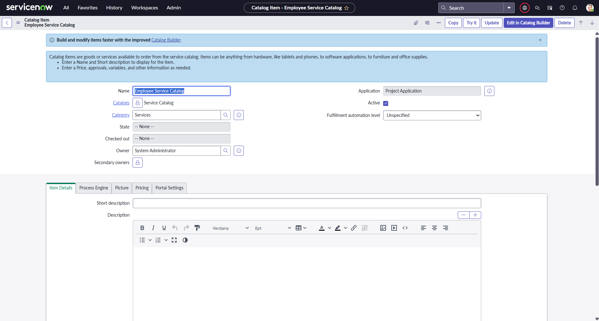

### 13. Manager Approval
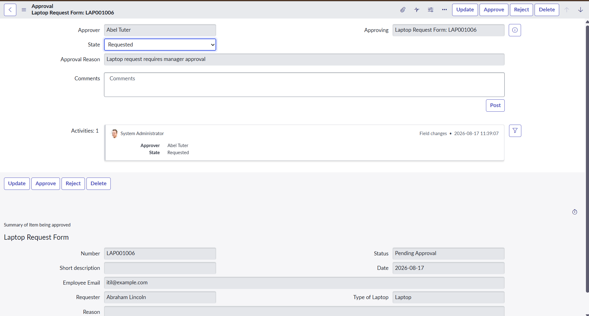

### 14. Approval Result
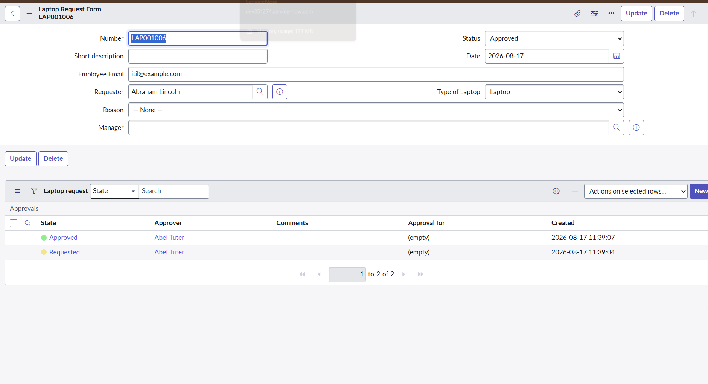

### 15. Flow Designer

### 14. Approval Result


### 15. Flow Designer
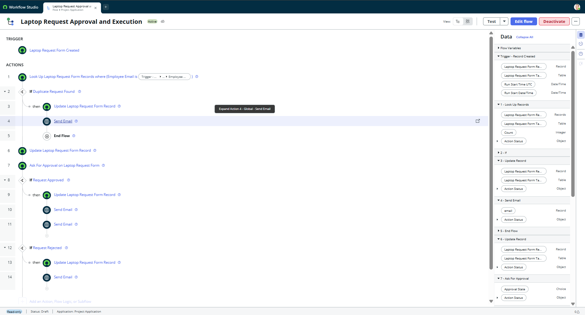
 
